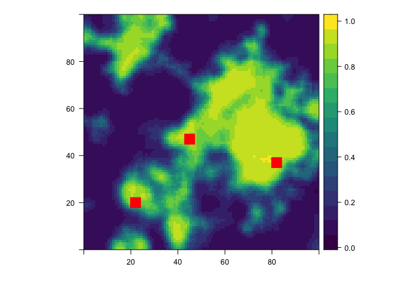

[](https://doi.org/10.5281/zenodo.1211182) [](https://travis-ci.org/mrecos/klrfome)

<p align="center">

</p>
klrfome - Kernel Logistic Regression on Focal Mean Embeddings
-------------------------------------------------------------

The purpose of this package is to solve the *Distribution Regression* problem for archaeological site location modeling; or any other data for that matter. The aim of Distribution Regression is to map a single scalar outcome (e.g. presence/absence; 0/1) to a distribution of features. This is opposed to typical regression where you have one observation mapping a single outcome to a single set of features/predictors. For example, an archaeological site is singularly defined as either present or absent, however the area within the sites boundary is not singularly defined by any one measurement. The area with an archaeology site is defined by an infinite distribution of measurements. Modeling this in traditional terms means either collapsing that distribution to a single measurement or pretending that a site is actually a series of adjacent, but independent measurements. The methods developed for this package take a different view instead by modeling the distribution of measurements from within a single site on a scale of similarity to the distribution of measurements on other sites and the environmental background in general. This method avoids collapsing measurements and promotes the assumption of independence from within a site to between sites. By doing so, this approach models a richer description of the landscape in a more intuitive sense of similarity.

To achieve this goal, the package fits a Kernel Logistic Regression (KLR) model onto a mean embedding similarity matrix and predicts as a roving focal function of varying window size. The name of the package is derived from this approach; **K**ernel **L**ogistic **R**egression on **FO**cal **M**ean **E**mbeddings (**klrfome**) pronounced *clear foam*.

<p align="left">

</p>
### Citation

Please cite this compendium as:

> Harris, Matthew D., (2017). *klrfome - Kernel Logistic Regression on Focal Mean Embeddings*. Accessed 10 Sep 2017. Online at <https://doi.org/10.5281/zenodo.1211182>

### Installation

You can install klrfome from github with:

``` r
# install.packages("devtools")
devtools::install_github("mrecos/klrfome")
```

Example workflow on simulated data (Try me!)
--------------------------------------------

#### Libraries

``` r
library("ggplot2")   # for plotting results
library("NLMR")      # for creating simulated landscapes
library("rasterVis") # for plotting simulated lan
library("klrfome")   # for modeling
```

#### Set hyperparameters and load simulated site location data

In this block, the random `seed`, `sigma` and `lambda` hyperparameters, and the `dist_metric` are all set. The `sigma` parameter controls how "close" observations must be to be considered similar. Closeness in this context is defined in the 'feature space', but in geographic or measurement space. At a higher `sigma` more distant observations can still be considered similar. The `lambda` hyperparameter controls the regularization in the KLR model by penalizing large coefficients; it must by greater than zero. This means that the higher the `lambda` penalty, the closer the model will shrink its `alpha` parameters closer to zero, thereby reducing the influence of any one or group of observations on the overall model. These two hyperparameters are most critical as the govern the flexibility and scope of the model. Ideally, these will be set via k-fold Cross-Validation, Leave-one-out cross-validation, grid search, or trial and error. Exploring these hyperparameters will likely take most of the time and attention within the modeling process.

``` r
#Parameters
set.seed(1337)
sigma = 0.5
lambda = 0.1
dist_metric = "euclidean"
```

#### Simulate site data and format

Archaeological site data is protected information that can not often be shared. It is a major impediment to open archaeological research. In this package I created a function to simulate archaeological site data so that people can test the package and see how to format their site data. The `get_sim_data` function simulates `N_site_bags` number of sites from `site_sample` number of observations for two environmental variables. The variables are normal with a mean and standard deviation; well-discriminated defaults are provided. The function simulates by site-present and environmental background classes with different means and SD's for the two variables. The returned object is a `list` that contains the data in a `list` format for use in the `KLR` functions, but also a `table` format for use in most other modeling functions. This is so that you can compare model results on the same data.

``` r
### Simulate Training Data
sim_data <- get_sim_data(site_samples = 800, N_site_bags = 75)
formatted_data <- format_site_data(sim_data, N_sites=10, train_test_split=0.8,
                                   sample_fraction = 0.9, background_site_balance=1)
train_data <- formatted_data[["train_data"]]
train_presence <- formatted_data[["train_presence"]]
test_data <- formatted_data[["test_data"]]
test_presence <- formatted_data[["test_presence"]]
```

#### Build Similarilty kernel, fit KLR model, and predict on training set

The first step in modeling these data is to build the similarity kernel with `build_k`. The output is a pairwise similarity matrix for each element of the list you give it, in this case `training_data`. The object `K` is the NxN similarity matrix of the mean similarity between the multivariate distance of each site and background list element. These elements are often referred to as *laballed bags* because they are a collection of measurements with a presence or absence label. The second step is to fit the `KLR` model with the `KLR` function. The `KLR` fit function is a key component of this package. The function fits a KLR model using Iterative Re-weighted Least Squares (IRLS). `Verbose = 2` shows the convergence of the algorithm. The output of this function is a `list` of the alpha parameters (for prediction) and predicted probability of site-present for the `train_data` set. Finally, the `KLR_predict` function uses the `train_data` and `alphas` to predict the probability of site-presence for new `test_data`. The similarity matrix can be visualized with `corrplot`, the predicted site-presence probability for simulated site-present and background test data can be viewed as a `ggplot`, and finally the parameters of the model are saved to a `list` to be used for predicting on a study area raster stack.

``` r
##### Logistic Mean Embedding KRR Model
#### Build Kernel Matrix
K <- build_K(train_data, sigma = sigma, dist_metric = dist_metric, progress = FALSE)
#### Train KLR model
train_log_pred <- KLR(K, train_presence, lambda, 100, 0.001, verbose = 2)
#> Step 1. Absolute Relative Approximate Error = 125.6576
#> Step 2. Absolute Relative Approximate Error = 12.488
#> Step 3. Absolute Relative Approximate Error = 0.322
#> Step 4. Absolute Relative Approximate Error = 0.0369
#> Step 5. Absolute Relative Approximate Error = 0
#> Found solution in 5 steps.
#### Predict KLR model on test data
test_log_pred <- KLR_predict(test_data, train_data, dist_metric = dist_metric,
                             train_log_pred[["alphas"]], sigma, progress = FALSE)

### Plot K Matrix
K_corrplot(K,train_data,clusters=4)
```


``` r

### Plot Test Set Prediction
predicted_log <- data.frame(pred = test_log_pred, obs = test_presence)
ggplot(predicted_log, aes(x = as.factor(obs), y = pred, color = as.factor(obs))) +
  geom_jitter(width = 0.1) +
  theme_bw() +
  ylim(c(0,1)) +
  labs(y = "Predicted Probability", x = "Site Presence",
       title = "Kernel Logistic Regression",
       subtitle = "test set predictions; simulated data") +
  theme(
    legend.position = "none"
  )
```


``` r

### Save parameters for later prediction
params <- list(train_data = train_data,
               alphas_pred = train_log_pred[["alphas"]],
               sigma = sigma,
               lambda = lambda,
               means = formatted_data$means,
               sds = formatted_data$sds)
```

#### Predicting on a raster stack

This package can be used to predict on tabular data as above, but a more practical approach is to predict directly on a set of raster layers representing the predictor variables. Most of the code below is there for creating a simulated landscape that has some fidelity to the training data. For real-world examples, the prediction starts with a raster stack of predictor variable rasters. Form there the function `scale_prediction_rasters` center and scales the values of the rasters to that of the train\_data. Having data that is centered at zero and scaled to z-scores is critical in measuring the distance between observations. Further, it is critical that the test data (raster stack) is scaled to the same values as the training data or the predictions will be invalid. Once scaled, the raster stack is sent to the `KLR_raster_predict` function for prediction. The prediction function requires a scaled raster stack of the same variables used to train the model, the `ngb` value that specifies the x and y dimension of the focal window, and finally the list of params from the trained model. The setting on `KLR_raster_predict` shown here are predicting over the entire raster at once and not in parallel. The `KLR_raster_predict` function has options for splitting the prediction into a number of squares and predicting on each of those. Further, each split raster block can be assigned to a different core on your computer to compute in parallel. This is because prediction is a time consuming process and it is often helpful to split the computation into more manageable blocks. Oh, and you can set it to return the predicted blocks as a list of raster (all in memory) or to save each block as a GeoTiff after it is predicted. A version of parallel processing is shown in the next code section.

``` r
### width and hieght of roving focal window (required)
ngb = 5
### Number of rows and columns in prediction rasters
## needed for making simulated rasters, as well as for predicting real-world rasters
cols = 100
rows = 100

### Create simulated environmental rasters  (sim data only) ####
s_var1r <- NLMR::nlm_gaussianfield(cols,rows, autocorr_range = 20)
s_var1 <- rescale_raster(s_var1r, 50, 10) 
s_var2 <- rescale_raster(s_var1r, 3, 2) 
b_var1r <- NLMR::nlm_gaussianfield(cols,rows,autocorr_range = 20)
b_var1 <- rescale_raster(b_var1r, 100, 20) 
b_var2 <- rescale_raster(b_var1r, 6, 3) 
### Create a site-present trend surface  (sim data only)
trend_coords <- sim_trend(cols, rows, n = 3)
coords <- trend_coords$coords
trend <- trend_coords$trend
inv_trend <- abs(1-trend)
var1 <- (s_var1 * trend) + (b_var1 * inv_trend)
var2 <- (s_var2 * trend) + (b_var2 * inv_trend)
#### end simulated data creation ####

### Create raster stack of predictor variables
pred_var_stack <- raster::stack(var1, var2)
names(pred_var_stack) <- c("var1","var2")
### scale rasters to training data
pred_var_stack_scaled <- scale_prediction_rasters(pred_var_stack, params, verbose = 0)
### Predict raster (single chunk, not in parallel) 
pred_rast <- KLR_raster_predict(pred_var_stack_scaled, ngb = ngb, params, split = FALSE, ppside = NULL,
                                progress = FALSE, parallel = FALSE)
### plot with simulated sites
rasterVis::levelplot(pred_rast, margin = FALSE, par.settings=viridisTheme()) +
  layer(sp.points(sp.points(SpatialPoints(coords), pch=15, cex = 2.25, col = "red")), columns=1)
```



### Predicting in parallel/multi-core

This package uses the `foreach` package's `%dopar%` function to parallelize model prediction. To make this work you need to start a parallel backend. Here I show how to do this with `doParallel` package. It is simple in most cases, just make a cluster with `makeCluster` and the number of cores you have available and then register the cluster with `registerDoParallel` (note the use of `stopCluster()` when you are done). In the `KLR_raster_predict` function, you need to set a few things. Set `parallel` = `TRUE`, `split` = `TRUE`, and `ppside` is the number of raster blocks on the x and y axis (resulting in `ppside`^2 number of output rasters). The function also gives the options for `output = "list"` to return a `list` or `output = "save"` to save each raster as a GeoTiff to the `save_loc` directory. Finally, the `cols` and `rows` values are used here so that the split function knows the dimensions of the entire prediction raster. It need to know this becuase it mitigates the edge effect predicting on blocks by putting a collar of size `ngb` around each block. The `cols` and `rows` lets the function know when to remove the collar and when it is at an edge of the study area.

``` r
library("doParallel")
#> Warning: package 'doParallel' was built under R version 3.4.4
#> Loading required package: foreach
#> Loading required package: iterators
#> Loading required package: parallel
### create and register parallel backend
cl <- makeCluster(detectCores())
doParallel::registerDoParallel(cl)

### Use same KLR_raster_predict function with parallel = TRUE
pred_rast_list <- KLR_raster_predict(pred_var_stack_scaled, ngb = ngb, params, split = TRUE, ppside = 5,
                                   progress = FALSE, parallel = TRUE, output = "list",
                                   save_loc = NULL, overwrite = TRUE, cols = cols, rows = rows)
#> Splitting rasters into blocks 
#> Predicting splits in parallel on 8 cores
### Merge list back to a single raster
pred_rast <-  do.call(merge, pred_rast_list)
### plot with simulated sites
rasterVis::levelplot(pred_rast, margin = FALSE, par.settings=viridisTheme()) +
  layer(sp.points(sp.points(SpatialPoints(coords), pch=15, cex = 2.25, col = "red")), columns=1)
```


``` r

### Or set output = "save" to save each prediction block out to a folder as a GeoTiff # not run
# pred_rast_list <- KLR_raster_predict(pred_var_stack_scaled, ngb = ngb, params, split = TRUE, ppside = 5,
#                                    progress = FALSE, parallel = TRUE, output = "save",
#                                    save_loc = "c:/Temp/tif", overwrite = TRUE)

stopCluster(cl)
```

### Main Package Functions

This package contains the functions necessary to compute Kernel Linear Regression (KLR) on mean kernel embeddings, functions for preparing site and background data, and a function for simulate archaeological site location data.

#### Fitting and Predicting

-   `build_K` - Function takes list of training data, scalar value for `sigma` hyperparameter, and a distance method to compute a mean embedding similarity kernel. This kernel is a pair-wise (N x N) matrix of the mean similarity between the attributes describing each site location and background group.
-   `KLR` - Function takes the similarity kernel matrix `K`, a vector of presence/absence coded as `1` or `0`, and a scalar value for the `lambda` regularizing hyperparameter; optionally values for maximum iterations and threshold. This function performs Kernel Logistic Regression (KLR) via Iterative Re-weighted Least Squares (IRLS). The objective is to approximate a set of parameters that minimize the negative likelihood of the parameters given the data and response. This function returns a list of `pred`, the estimated response (probability of site-presence) for the training data, and `alphas`, the approximated parameters from the IRLS algorithm.
-   `KLR_predict` - Function takes a list of the training data, a list of the testing data, a vector of the approximated `alphas` parameters, a scalar value for the `sigma` kernel hyperparameter, and a distance method. This function predicts the probability of site presence for new observations based on the training data and `alphas` parameters. This is accomplished by building the `k*k` kernel matrix as the similarity between the training test data then computing the inverse logit of `k*k %*% alphas`. The output is the predicted probability of site presence for each training data example.

#### Data Formatting

-   `format_site_data` - Function takes a `data.frame` of presence/background observations. The column `presence` indicated site presence of background as `1` or `0` respectively. The `SITENO` column indicates either a site identifier or `background`. The remaining columns should be measurements of environmental or cultural variables for modeling similarity. It is expected that each site will have multiple rows indicating multiple measurements of environmental variables from within the site boundary or land form. The function centers and scales the predictor variables, sub-samples the data into training and test sets, and re-formats the data as both tabular format and list format for both training and test data sets. Importantly, the function makes sure that no single site is in both the training and test set. No test sites are used to train the model. Also returned is the mean and standard deviation of the data so that new data can be center and scaled to the same parameters.
-   `get_sim_data` - Function takes a mean and SD for two simulated predictor variables for each of sites and background. With archaeological site data being a protected data set in many settings (including this project), it cannot be freely shared. However, it is difficult to implement this model without properly format data. This function simulates archaeological site data and background environmental data for testing or tuning of this model. The concept of the function is to simulate two predictor variables for both sites and background. The inputs to the function (defaults provided) control how similar or different the site data is from the background. The model can be tested on simulated site data that is very similar to the background or very different; the model behaves accordingly. The output of the function is formatted in the same way as the `format_site_data` function.

#### Calculating Performance Metrics

-   `metrics` -

#### Plotting

-   `K_corrplot` -

### Licenses

**Text and figures:** [CC-BY-4.0](http://creativecommons.org/licenses/by/4.0/)

**Code:** See the [DESCRIPTION](DESCRIPTION) file

**Data:** [CC-0](http://creativecommons.org/publicdomain/zero/1.0/) attribution requested in reuse

### Contributions

We welcome contributions from everyone. Before you get started, please see our [contributor guidelines](CONTRIBUTING.md). Please note that this project is released with a [Contributor Code of Conduct](CONDUCT.md). By participating in this project you agree to abide by its terms.
