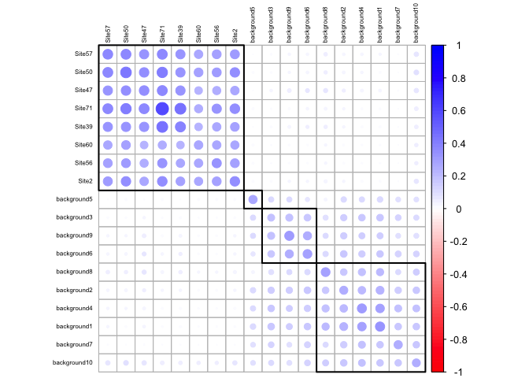
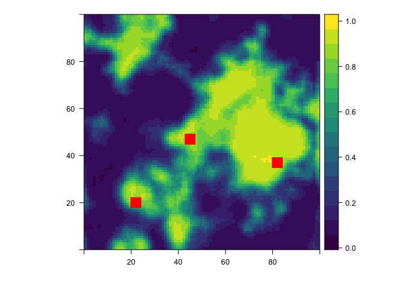

[](https://github.com/mrecos/klrfome/actions/workflows/R-CMD-check.yaml)

[](https://zenodo.org/badge/latestdoi/103055953)

last build: Mon Jan 24 11:40:47 2022

<p align="center">

</p>

#### klrfome - Kernel Logistic Regression on Focal Mean Embeddings

[Check out the documentation site](https://mrecos.github.io/klrfome/)

The purpose of this package is to solve the *Distribution Regression*
problem for noncontiguous geospatial features. The use case documented here is for modeling archaeological site locations. The aim of Distribution Regression is to map a single
scalar outcome (e.g. presence/absence; 0/1) to a distribution of
features. This is opposed to typical regression where you have one
observation mapping a single outcome to a single set of
features/predictors. For example, an archaeological site is singularly
defined as either present or absent, however the area within the sites
boundary is not singularly defined by any one measurement. The area with
an archaeology site is defined by an infinite distribution of
measurements. Modeling this in traditional terms means either collapsing
that distribution to a single measurement or pretending that a site is
actually a series of adjacent, but independent measurements. The methods
developed for this package take a different view instead by modeling the
distribution of measurements from within a single site on a scale of
similarity to the distribution of measurements on other sites and the
environmental background in general. This method avoids collapsing
measurements and promotes the assumption of independence from within a
site to between sites. By doing so, this approach models a richer
description of the landscape in a more intuitive sense of similarity.

To achieve this goal, the package fits a Kernel Logistic Regression
(KLR) model onto a mean embedding similarity matrix and predicts as a
roving focal function of varying window size. The name of the package is
derived from this approach; **K**ernel **L**ogistic **R**egression on
**FO**cal **M**ean **E**mbeddings (**klrfome**) pronounced *clear foam*.

<p align="center">

</p>

(High-res versions of research poster are in the
[/SAA_2018_poster](https://github.com/mrecos/klrfome/tree/master/SAA_2018_poster)
folder)

### Citation

Please cite this package as:

> Harris, Matthew D., (2017). *klrfome - Kernel Logistic Regression on
> Focal Mean Embeddings*. Accessed 10 Sep 2017. Online at
> <https://doi.org/10.5281/zenodo.1218403>

### Special Thanks

This model is inspired by and borrows from Zoltán Szabó’s work on mean
embeddings Szabó et al. (2015) and Ji Zhu & Trevor Hastie’s Kernel
Logistic Regression algorithm (Zhu and Hastie 2005). I extend a hardy
**thank you** to Zoltán for his correspondence during the development of
this approach. This approach would not have been created without his
help. Further, a big **thank you** to Ben Markwick for his moral support
and `rrtools` package used to create this package. However that being
said, all errors, oversights, and omissions are my own.

### Installation

You can install klrfome from github with:

``` r
# install.packages("devtools")
devtools::install_github("mrecos/klrfome")
```

## Example workflow on simulated data (Try me!)

<p align="left">

</p>

In brief, the process below is 1) take a table of observations of two or
more environmental variables within known sites and across the
background of the study area; 2) use `format_data()` to convert that
table to a list and under-sample the background data to a desired ratio
(each group of observations with a site or background area are referred
o in the ML literature as “bags”); 3) use `build_k()` function with the
`sigma` hyperparameter and distance (default `euclidean`) to create a
similarity matrix between all site and background bags; 4) the
similarity matrix is the object that the kernel logistic regression
model `klr()` function uses to fit its parameters. Steps 3 and 4 are
where this method detracts most from traditional regression, but it is
also what sets this method apart. unlike most regression that fits a
model to a table of measurements, this approach fits a model to a matrix
of similarities between all of the units of analysis (sites and
background areas).

#### Libraries

``` r
library("ggplot2")   # for plotting results
library("NLMR")      # for creating simulated landscapes
library("rasterVis") # for plotting simulated lan
library("pROC")      # for evaluation of model AUC metric
library("dplyr")     # for data manipulation
library("knitr")     # for printing tables in this document
library("klrfome")   # for modeling
library("sp")        # for plotting raster prediction in document
```

#### Set hyperparameters and load simulated site location data

In this block, the random `seed`, `sigma` and `lambda` hyperparameters,
and the `dist_metric` are all set. The `sigma` parameter controls how
“close” observations must be to be considered similar. Closeness in this
context is defined in the ‘feature space,’ but in geographic or
measurement space. At a higher `sigma` more distant observations can
still be considered similar. The `lambda` hyperparameter controls the
regularization in the KLR model by penalizing large coefficients; it
must by greater than zero. This means that the higher the `lambda`
penalty, the closer the model will shrink its `alpha` parameters closer
to zero, thereby reducing the influence of any one or group of
observations on the overall model. These two hyperparameters are most
critical as the govern the flexibility and scope of the model. Ideally,
these will be set via k-fold Cross-Validation, Leave-one-out
cross-validation, grid search, or trial and error. Exploring these
hyperparameters will likely take most of the time and attention within
the modeling process.

``` r
#Parameters
set.seed(232)
sigma = 0.5
lambda = 0.1
dist_metric = "euclidean"
```

#### Simulate site data and format

Archaeological site data is protected information that can not often be
shared. It is a major impediment to open archaeological research. In
this package I created a function to simulate archaeological site data
so that people can test the package and see how to format their site
data. The `get_sim_data` function simulates `N_site_bags` number of
sites from `site_sample` number of observations for two environmental
variables. The variables are normal with a mean and standard deviation;
well-discriminated defaults are provided. The function simulates by
site-present and environmental background classes with different means
and SD’s for the two variables. The returned object is a `list` that
contains the data in a `list` format for use in the `KLR` functions, but
also a `table` format for use in most other modeling functions. This is
so that you can compare model results on the same data.

``` r
### Simulate Training Data
sim_data <- get_sim_data(site_samples = 800, N_site_bags = 75)
formatted_data <- format_site_data(sim_data, N_sites=10, train_test_split=0.8,
                                   sample_fraction = 0.9, background_site_balance=1)
train_data <- formatted_data[["train_data"]]
train_presence <- formatted_data[["train_presence"]]
test_data <- formatted_data[["test_data"]]
test_presence <- formatted_data[["test_presence"]]
```

#### Build Similarilty kernel, fit KLR model, and predict on training set

The first step in modeling these data is to build the similarity kernel
with `build_k`. The output is a pairwise similarity matrix for each
element of the list you give it, in this case `training_data`. The
object `K` is the NxN similarity matrix of the mean similarity between
the multivariate distance of each site and background list element.
These elements are often referred to as *laballed bags* because they are
a collection of measurements with a presence or absence label. The
second step is to fit the `KLR` model with the `KLR` function. The `KLR`
fit function is a key component of this package. The function fits a KLR
model using Iterative Re-weighted Least Squares (IRLS). `Verbose = 2`
shows the convergence of the algorithm. The output of this function is a
`list` of the alpha parameters (for prediction) and predicted
probability of site-present for the `train_data` set. Finally, the
`KLR_predict` function uses the `train_data` and `alphas` to predict the
probability of site-presence for new `test_data`. The similarity matrix
can be visualized with `corrplot`, the predicted site-presence
probability for simulated site-present and background test data can be
viewed as a `ggplot`, and finally the parameters of the model are saved
to a `list` to be used for predicting on a study area raster stack.

``` r
##### Logistic Mean Embedding KRR Model
#### Build Kernel Matrix
K <- build_K(train_data, sigma = sigma, dist_metric = dist_metric, progress = FALSE)
#### Train KLR model
train_log_pred <- KLR(K, train_presence, lambda, 100, 0.001, verbose = 2)
#> Step 1. Absolute Relative Approximate Error = 120.2567
#> Step 2. Absolute Relative Approximate Error = 9.6064
#> Step 3. Absolute Relative Approximate Error = 0.6178
#> Step 4. Absolute Relative Approximate Error = 0.0477
#> Step 5. Absolute Relative Approximate Error = 0
#> Found solution in 5 steps.
#### Predict KLR model on test data
test_log_pred <- KLR_predict(test_data, train_data, dist_metric = dist_metric,
                             train_log_pred[["alphas"]], sigma, progress = FALSE)

### Plot K Matrix
K_corrplot(K,train_data,clusters=4)
#> Warning in text.default(pos.xlabel[, 1], pos.xlabel[, 2], newcolnames, srt =
#> tl.srt, : "cl.lim" is not a graphical parameter
#> Warning in text.default(pos.ylabel[, 1], pos.ylabel[, 2], newrownames, col =
#> tl.col, : "cl.lim" is not a graphical parameter
#> Warning in title(title, ...): "cl.lim" is not a graphical parameter
```

<!-- -->

``` r
### Plot Test Set Prediction
predicted_log <- data.frame(pred = test_log_pred, obs = test_presence)
ggplot(predicted_log, aes(x = as.factor(obs), y = pred, color = as.factor(obs))) +
  geom_jitter(width = 0.1) +
  theme_bw() +
  ylim(c(0,1)) +
  labs(y = "Predicted Probability", x = "Site Presence",
       title = "Kernel Logistic Regression",
       subtitle = "test set predictions; simulated data") +
  theme(
    legend.position = "none"
  )
```

<!-- -->

``` r
### Save parameters for later prediction
params <- list(train_data = train_data,
               alphas_pred = train_log_pred[["alphas"]],
               sigma = sigma,
               lambda = lambda,
               means = formatted_data$means,
               sds = formatted_data$sds)
```

#### Predicting on a raster stack

<p align="left">

</p>

This package can be used to predict on tabular data as above, but a more
practical approach is to predict directly on a set of raster layers
representing the predictor variables. Most of the code below is there
for creating a simulated landscape that has some fidelity to the
training data. For real-world examples, the prediction starts with a
raster stack of predictor variable rasters. Form there the function
`scale_prediction_rasters` center and scales the values of the rasters
to that of the train_data. Having data that is centered at zero and
scaled to z-scores is critical in measuring the distance between
observations. Further, it is critical that the test data (raster stack)
is scaled to the same values as the training data or the predictions
will be invalid. Once scaled, the raster stack is sent to the
`KLR_raster_predict` function for prediction. The prediction function
requires a scaled raster stack of the same variables used to train the
model, the `ngb` value that specifies the x and y dimension of the focal
window, and finally the list of params from the trained model. The
setting on `KLR_raster_predict` shown here are predicting over the
entire raster at once and not in parallel. The `KLR_raster_predict`
function has options for splitting the prediction into a number of
squares and predicting on each of those. Further, each split raster
block can be assigned to a different core on your computer to compute in
parallel. This is because prediction is a time consuming process and it
is often helpful to split the computation into more manageable blocks.
Oh, and you can set it to return the predicted blocks as a list of
raster (all in memory) or to save each block as a GeoTiff after it is
predicted. A version of parallel processing is shown in the next code
section.

``` r
### width and hieght of roving focal window (required)
ngb = 5
### Number of rows and columns in prediction rasters
## needed for making simulated rasters, as well as for predicting real-world rasters
cols = 100
rows = 100

### Create simulated environmental rasters  (sim data only) ####
s_var1r <- NLMR::nlm_gaussianfield(cols,rows, autocorr_range = 20)
s_var1 <- rescale_sim_raster(s_var1r, 50, 10) 
s_var2 <- rescale_sim_raster(s_var1r, 3, 2) 
b_var1r <- NLMR::nlm_gaussianfield(cols,rows,autocorr_range = 20)
b_var1 <- rescale_sim_raster(b_var1r, 100, 20) 
b_var2 <- rescale_sim_raster(b_var1r, 6, 3) 
### Create a site-present trend surface  (sim data only)
trend_coords <- sim_trend(cols, rows, n = 3)
coords <- trend_coords$coords
trend <- trend_coords$trend
inv_trend <- abs(1-trend)
var1 <- (s_var1 * trend) + (b_var1 * inv_trend)
var2 <- (s_var2 * trend) + (b_var2 * inv_trend)
#### end simulated data creation ####

### Create raster stack of predictor variables
pred_var_stack <- raster::stack(var1, var2)
names(pred_var_stack) <- c("var1","var2")
### scale rasters to training data
pred_var_stack_scaled <- scale_prediction_rasters(pred_var_stack, params, verbose = 0)
### Predict raster (single chunk, not in parallel) 
pred_rast <- KLR_raster_predict(pred_var_stack_scaled, ngb = ngb, params, split = FALSE, ppside = NULL,
                                progress = FALSE, parallel = FALSE)
### plot with simulated sites
rasterVis::levelplot(pred_rast, margin = FALSE, par.settings=viridisTheme()) +
  latticeExtra::layer(sp.points(SpatialPoints(coords), pch=15, cex = 2.25, col = "red"))
```

<!-- -->

### Predicting in parallel/multi-core

This package uses the `foreach` package’s `%dopar%` function to
parallelize model prediction. To make this work you need to start a
parallel backend. Here I show how to do this with `doParallel` package.
It is simple in most cases, just make a cluster with `makeCluster` and
the number of cores you have available and then register the cluster
with `registerDoParallel` (note the use of `stopCluster()` when you are
done). In the `KLR_raster_predict` function, you need to set a few
things. Set `parallel` = `TRUE`, `split` = `TRUE`, and `ppside` is the
number of raster blocks on the x and y axis (resulting in `ppside`^2
number of output rasters). The function also gives the options for
`output = "list"` to return a `list` or `output = "save"` to save each
raster as a GeoTiff to the `save_loc` directory. Finally, the `cols` and
`rows` values are used here so that the split function knows the
dimensions of the entire prediction raster. It need to know this becuase
it mitigates the edge effect predicting on blocks by putting a collar of
size `ngb` around each block. The `cols` and `rows` lets the function
know when to remove the collar and when it is at an edge of the study
area.

``` r
library("parallel")
library("doParallel")
#> Loading required package: foreach
#> Loading required package: iterators
### create and register parallel backend
cl <- parallel::makeCluster(parallel::detectCores())
doParallel::registerDoParallel(cl)

### Use same KLR_raster_predict function with parallel = TRUE
pred_rast_list <- KLR_raster_predict(pred_var_stack_scaled, ngb = ngb, params, split = TRUE, ppside = 5,
                                   progress = FALSE, parallel = TRUE, output = "list",
                                   save_loc = NULL, overwrite = TRUE, cols = cols, rows = rows)
#> Splitting rasters into blocks 
#> Predicting splits in parallel on 8 cores
### Merge list back to a single raster
pred_rast <-  do.call(merge, pred_rast_list)
### plot with simulated sites
rasterVis::levelplot(pred_rast, margin = FALSE, par.settings=viridisTheme()) +
  latticeExtra::layer(sp.points(sp.points(SpatialPoints(coords), pch=15, cex = 2.25, col = "red")), columns=1)
```

<!-- -->

``` r
### Or set output = "save" to save each prediction block out to a folder as a GeoTiff # not run
# pred_rast_list <- KLR_raster_predict(pred_var_stack_scaled, ngb = ngb, params, split = TRUE, ppside = 5,
#                                    progress = FALSE, parallel = TRUE, output = "save",
#                                    save_loc = "c:/Temp/tif", overwrite = TRUE)

parallel::stopCluster(cl)
```

#### Model Evaluation

Evaluating model on independent test data is very important for
understanding the models ability to generalize to new observations. The
`klrfome` package provides two functions to assist with this;
`CM-quads()` and `metrics()`. In order to use these functions, the user
needs to extract the sensitivity values output from `klr_raster_predict`
at both site locations (preferably not those used to create the model)
and a large number of random locations to sample the full distribution
of sensitivities. The code below uses the simulated site locations,
`raster::extract`, and `sampleRandom` to obtain these values. Once the
values are put into a table and labelled as 1 or 0, the `CM-quads`
function is applied to retrieve the True Positive, True Negative, False
Positive, and False Negative values of the model at one or more
probability thresholds. Choosing the appropriate threshold at which to
classify a model into High, Moderate, and Low or Site-present
vs. site-absent needs a good deal of consideration for both the
intrinsic model quality and extrinsic model goals. Here I show how to
evaluate the classification metrics at every `0.1` threshold between 0
and 1. The results from `CM_quads` (named for the four quadrants of the
confusion matrix) are then evaluated with the `pROC::auc` and
`klrfome::metrics` functions to calculate the metrics of choice.

``` r
### Make some polygons around the simulated site points.
### If all you have is points for sites, site radius can be an assumption
site_pnts  <- SpatialPoints(coords)
site_polys <- rgeos::gBuffer(site_pnts, width = 6, byid = FALSE)

### extract sensitivity raster values to site areas
site_sample <- raster::extract(pred_rast, site_polys, weights = FALSE, 
                               small = TRUE, df = TRUE) %>%
  rename(pred = layer) %>%
  mutate(presence = 1)
### sample for an environmental background of sensitivity values. (e.g. n = 500)
bkg_sample <- data.frame(ID = 0, pred = raster::sampleRandom(pred_rast, 500),
                         presence = 0)
model_pred <- rbind(site_sample, bkg_sample)

### A vector of the sensitivity thresholds that you want to evaluate the model at
threshold <- seq(0,1,0.1)
### Compute True Positive, True Negative, False Positive, and False Negative values at each threshold
kstats <- CM_quads(model_pred, threshold)

### use the pROC::auc and klrfome::metrics functions to compute the metrics of choice at each threshold
Test_area_metrics <- kstats %>%
  group_by(Threshold) %>%
  dplyr::mutate(AUC = round(pROC::auc(model_pred$presence, model_pred$pred, type = "linear"),3),
                YoudensJ = round(metrics(TP,TN,FP,FN)$Informedness,3),
                KG       = round(metrics(TP,TN,FP,FN)$KG,3),
                Sensitivity = round(metrics(TP,TN,FP,FN)$Sensitivity,3),
                FPR = round(metrics(TP,TN,FP,FN)$FPR,3),
                FNR = round(metrics(TP,TN,FP,FN)$FNR,3)) %>%
  data.frame()
#> Setting levels: control = 0, case = 1
#> Setting direction: controls < cases
#> Setting levels: control = 0, case = 1
#> Setting direction: controls < cases
#> Setting levels: control = 0, case = 1
#> Setting direction: controls < cases
#> Setting levels: control = 0, case = 1
#> Setting direction: controls < cases
#> Setting levels: control = 0, case = 1
#> Setting direction: controls < cases
#> Setting levels: control = 0, case = 1
#> Setting direction: controls < cases
#> Setting levels: control = 0, case = 1
#> Setting direction: controls < cases
#> Setting levels: control = 0, case = 1
#> Setting direction: controls < cases
#> Setting levels: control = 0, case = 1
#> Setting direction: controls < cases
#> Setting levels: control = 0, case = 1
#> Setting direction: controls < cases
#> Setting levels: control = 0, case = 1
#> Setting direction: controls < cases

knitr::kable(Test_area_metrics)
```

| Threshold |  TP |  FP |  TN |  FN |  AUC | YoudensJ |    KG | Sensitivity |   FPR |   FNR |
|----------:|----:|----:|----:|----:|-----:|---------:|------:|------------:|------:|------:|
|       0.0 | 336 | 500 |   0 |   0 | 0.85 |    0.000 | 0.000 |       1.000 | 1.000 | 0.000 |
|       0.1 | 336 | 357 | 143 |   0 | 0.85 |    0.286 | 0.286 |       1.000 | 0.714 | 0.000 |
|       0.2 | 334 | 281 | 219 |   2 | 0.85 |    0.432 | 0.435 |       0.994 | 0.562 | 0.006 |
|       0.3 | 322 | 237 | 263 |  14 | 0.85 |    0.484 | 0.505 |       0.958 | 0.474 | 0.042 |
|       0.4 | 318 | 203 | 297 |  18 | 0.85 |    0.540 | 0.571 |       0.946 | 0.406 | 0.054 |
|       0.5 | 311 | 179 | 321 |  25 | 0.85 |    0.568 | 0.613 |       0.926 | 0.358 | 0.074 |
|       0.6 | 296 | 150 | 350 |  40 | 0.85 |    0.581 | 0.659 |       0.881 | 0.300 | 0.119 |
|       0.7 | 277 | 126 | 374 |  59 | 0.85 |    0.572 | 0.694 |       0.824 | 0.252 | 0.176 |
|       0.8 | 238 |  96 | 404 |  98 | 0.85 |    0.516 | 0.729 |       0.708 | 0.192 | 0.292 |
|       0.9 | 112 |  42 | 458 | 224 | 0.85 |    0.249 | 0.748 |       0.333 | 0.084 | 0.667 |
|       1.0 |   0 |   0 | 500 | 336 | 0.85 |    0.000 |   NaN |       0.000 | 0.000 | 1.000 |

In this case those metrics are the `auc`, `Youdens J`, `KG` = Kvamme
Gain, `Sensitivity`, `FPR` = False Positive Rate, and `FNR` = False
Negative Rate. While there is no one metric that is a perfect descriptor
of model performance in all scenarios, these are the metrics that I find
most useful for describing archaeological predictive models. In this
example, I am aiming to maximize my two-class classification for the
Youden’s J (aka Informedness). As such, I would set my site-present
vs. site-absent `Threshold` at **0.6**. At this threshold we have a
`Sensitivity` = **0.881** and a `FPR` = **0.3**.

## Main Package Functions

This package contains the functions necessary to compute Kernel Linear
Regression (KLR) on mean kernel embeddings, functions for preparing site
and background data, and a function for simulate archaeological site
location data.

#### KLR_funs.R for Fitting and Predicting on Tabular Data

-   `build_K` - Function takes list of training data, scalar value for
    `sigma` hyperparameter, and a distance method to compute a mean
    embedding similarity kernel. This kernel is a pair-wise (N x N)
    matrix of the mean similarity between the attributes describing each
    site location and background group. Optional inouts are `progress`
    for a progress bar and `dist_metric` for the distance computation.
    By default, the distance metric is `euclidean` and should likely
    stay as such unless you have explored other distances and know
    why/how you want to use them.

-   `KLR` - Function takes the similarity kernel matrix `K`, a vector of
    presence/absence coded as `1` or `0`, and a scalar value for the
    `lambda` regularizing hyperparameter; optionally values for maximum
    iterations and threshold. This function performs Kernel Logistic
    Regression (KLR) via Iterative Re-weighted Least Squares (IRLS). The
    objective is to approximate a set of parameters that minimize the
    negative likelihood of the parameters given the data and response.
    This function returns a list of `pred`, the estimated response
    (probability of site-presence) for the training data, and `alphas`,
    the approximated parameters from the IRLS algorithm.

-   `KLR_predict` - Function takes a list of the training data, a list
    of the testing data, a vector of the approximated `alphas`
    parameters, a scalar value for the `sigma` kernel hyperparameter,
    and a distance method. This function predicts the probability of
    site presence for new observations based on the training data and
    `alphas` parameters. This is accomplished by building the `k*k`
    kernel matrix as the similarity between the training test data then
    computing the inverse logit of `k*k %*% alphas`. The output is the
    predicted probability of site presence for each training data
    example.

#### raster_predict_funs.R for Predicting on Raster Data

-   `rescale_sim_raster` - Function that rescales simulated rasters from
    `NLMR::nlm_gaussianfield` (Sciaini, Fritsch, and Simpkins 2017) or
    whatever you want to use, to the mean and standard deviation of the
    simulated data used to fit the `klr` model. You will have to add the
    `mean` and `sd` arguments manually based on what you put into the
    `get_sim_data` function. The example in the code above inputs the
    default `mean` and `sd` values from the defualts of the
    `get_sim_data` function. Returned is a raster scaled too your
    simualted training data.

-   `sim_trend` - Function is used to take create `n` number of
    simulated site locations of `size` cell dimensions on a `rows` by
    `cols` raster. The latter two arguments should match the size of
    your simulated rasters. The function randomly locates the sites and
    then creates a distance gradient (trend) from the site locations
    outward. The trend is a value `1` at the sites and reduces to `0` at
    the maximum combined distance from all sites. The output of this
    function is a `list` of a `matrix` of simulated site x/y coordinates
    (centers) and a `raster` of the trend surface. The point of the
    trend is to then combine it with the simulated rasters (as down in
    the code above) such that the raster depicting site-likely
    conditions is multiplied by the trend to output a raster retaining
    site-likely conditions near simulated site locations. Conversely,
    the site-unlikely simulated raster is multiplied by the inverse of
    the trend to result in a raster retaining site-unlikely
    characteristics away from the site locations. When those two rasters
    are added you get a simulated environment that is more preferable to
    site locations near site locations. It is a bit involved for
    something that had nothing to do with the actual KLRfome model, but
    it is needed to produce actual correlated environments for model
    testing.

-   `scale_prediction_rasters` - Function scales your predictor
    `rater stack` based on the `params` list created in the model
    fitting process. This script simply loops over the rasters in the
    stack and centers and scales based on mean and sd of the training
    data used to fit the `klr` model. The function outputs a
    `raster stack`.

-   `KLR_raster_predict` - Function predicts the probability of
    site-presence based on a `raster stack` of center/scaled predictor
    rasters, a focal neighborhood size in cells as `ngb`, and the
    `params` list of model fit parameters. Finally, the function also
    needs to the the number of columns as `cols` and rows as `rows` of
    the study areas raster stack. The rest of the arguments default to
    predicting the entire raster stack in one pass and only on a single
    core (not in parallel). The rest of the argument control whether the
    study area is split (`split = TRUE`) into a grid of blocks. The
    `ppside` positive integer controls the number of blocks along each
    axis of the study area. If you wish to compute the prediction in
    parallel, you will need to split it into blocks so that each block
    can be sent to a different processor core. The final set of optional
    arguments control how the prediction is returned, either as a
    `output = "list"` or `output = "save"` for returning a list of
    rasters of saving each out as a GeoTiff, and then arguments for the
    GeoTiff location with `save_loc` and whether to overwrite existing
    GeoTiffs with `overwrite`. The function contains a bit of logic to
    try and assist the user in which arguments go with what. Perhaps
    future versions will streamline this a bit.

#### format_site_data.R for Data Formatting

-   `format_site_data` - Function takes a `data.frame` of
    presence/background observations. The column `presence` indicated
    site presence of background as `1` or `0` respectively. The `SITENO`
    column indicates either a site identifier or `background`. The
    remaining columns should be measurements of environmental or
    cultural variables for modeling similarity. It is expected that each
    site will have multiple rows indicating multiple measurements of
    environmental variables from within the site boundary or land form.
    The function centers and scales the predictor variables, sub-samples
    the data into training and test sets, and re-formats the data as
    both tabular format and list format for both training and test data
    sets. Importantly, the function makes sure that no single site is in
    both the training and test set. No test sites are used to train the
    model. Also returned is the mean and standard deviation of the data
    so that new data can be center and scaled to the same parameters.

#### get_sim_data.R for Simulating Site Location Data

-   `get_sim_data` - Function takes a mean and SD for two simulated
    predictor variables for each of sites and background. With
    archaeological site data being a protected data set in many settings
    (including this project), it cannot be freely shared. However, it is
    difficult to implement this model without properly format data. This
    function simulates archaeological site data and background
    environmental data for testing or tuning of this model. The concept
    of the function is to simulate two predictor variables for both
    sites and background. The inputs to the function (defaults provided)
    control how similar or different the site data is from the
    background. The model can be tested on simulated site data that is
    very similar to the background or very different; the model behaves
    accordingly. The output of the function is formatted in the same way
    as the `format_site_data` function.

#### metrics.R for Calculating Performance Metrics

-   `CM_quads` - Function takes a data.frame of predicted probabilities
    (must be called `pred`) and actual observed presence/absence (must
    be called `presence` and contain `1 = presence` and `0 = absence`).
    Optional input is a threshold value or values in the form of a
    single scalar (default = 0.5) or a numeric vector to loop over. The
    function calculates the True Positive, True Negative, False
    Positive, and False Negative quantities at each threshold. These
    quantities are typically shown in a 2x2 confusion matrix, hence the
    name Confusion Matrix (CM) quadrants. The output is a data.frame
    with columns for the `TP`, `FP`, `TN`, and `FN` at each desired
    `Threshold`. This is useful for figuring out how the model performs
    at a variety of thresholds. In the example code above I also compute
    the `AUC` statistic that gives an indication of model performance
    across all thresholds.

-   `metrics` - Function provides a large quantity of metrics based on
    the quadrants of the Confusion Matrix derived from a threshold of
    the predicted probability values. The input to this function is the
    `TP`, `TN`, `FP`, and `FN` quantities of a thresholded model as
    derived from the `CM_quads` function. The output of this model is a
    list of `51` different metrics such as `Sensitivity`, `Youden's J`,
    `Positive Predictive Gain`, and many more. Some are commonplace and
    others are practically unknown. I put a few note in the function as
    to where they come from. The function returns all `51` as a list.

#### plot.R for Plotting Similarity Kernel

-   `K_corrplot` - Function is a pretty simple wrapper around
    `corrplot::corrplot()` with hierarchical clustering. Inputs for this
    function are the similarity matrix `K` and the `train_data` with the
    option of an integer for the number of clusters to partition the
    data; default = 4. Output is a plot or if assigned to an object, it
    is an object of class `matrix`.

# Licenses

**Text and figures:**
[CC-BY-4.0](http://creativecommons.org/licenses/by/4.0/)

**Code:** See the [DESCRIPTION](DESCRIPTION) file

**Data:** [CC-0](http://creativecommons.org/publicdomain/zero/1.0/)
attribution requested in reuse

# Contributions

We welcome contributions from everyone. Before you get started, please
see our [contributor guidelines](CONTRIBUTING.md). Please note that this
project is released with a [Contributor Code of Conduct](CONDUCT.md). By
participating in this project you agree to abide by its terms.

# References

<div id="refs" class="references csl-bib-body hanging-indent">

<div id="ref-Flaxman" class="csl-entry">

Flaxman, Seth, Yu-Xiang Wang, and Alexander J. Smola. 2015. “Who
Supported Obama in 2012?: Ecological Inference Through Distribution
Regression.” In *Proceedings of the 21th ACM SIGKDD International
Conference on Knowledge Discovery and Data Mining*, 289–98. ACM.

</div>

<div id="ref-2017arXiv170504293L" class="csl-entry">

Law, H. C. L., D. J. Sutherland, D. Sejdinovic, and S. Flaxman. 2017.
“<span class="nocase">Bayesian Approaches to Distribution
Regression</span>.” *ArXiv e-Prints*, May.
<https://arxiv.org/abs/1705.04293>.

</div>

<div id="ref-Muandet" class="csl-entry">

Muandet, Krikamol, Kenji Fukumizu, Bharath Sriperumbudur, and Bernhard
Schölkopf. 2017. “Kernel Mean Embedding of Distributions: A Review and
Beyond.” *Foundations and Trends in Machine Learning* 10 (1-2): 1–141.
<https://doi.org/10.1561/2200000060>.

</div>

<div id="ref-NLMR" class="csl-entry">

Sciaini, Marco, Matthias Fritsch, and Craig E. Simpkins. 2017. *NLMR:
Simulating Neutral Landscape Models* (version 0.2.0).
<https://CRAN.R-project.org/package=NLMR>.

</div>

<div id="ref-Song" class="csl-entry">

Song, Li, and Arthur Fukumizu Kenjiand Gretto. 2013. “Kernel Embeddings
of Conditional Distributions: A Unified Kernel Framework for
Nonparametric Inference in Graphical Models.” *IEEE Signal Processing
Magazine* 30 (4): 98–111. <https://doi.org/10.1109/msp.2013.2252713>.

</div>

<div id="ref-Szabo2" class="csl-entry">

Szabó, Zoltán, Arthur Gretton, Barnabás Póczos, and Bharath
Sriperumbudur. 2015. “Two-Stage Sampled Learning Theory on
Distributions.” In *International Conference on Artificial Intelligence
and Statistics (AISTATS)*, 948–57.

</div>

<div id="ref-Szabo" class="csl-entry">

Szabó, Zoltán, Bharath Sriperumbudur, Barnabás Póczos, and Arthur
Gretton. 2016. “Learning Theory for Distribution Regression.” *Journal
of Machine Learning Research* 17: 1–40.

</div>

<div id="ref-Zhu" class="csl-entry">

Zhu, Ji, and Trevor Hastie. 2005. “Kernel Logistic Regression and the
Import-Vector Machine.” *Journal of Computational and Graphical
Statistics* 14 (1): 185–205. <https://doi.org/10.1198/106186005x25619>.

</div>

</div>
